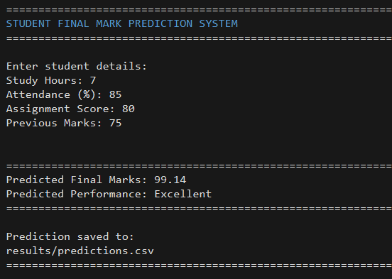

# Predicting Student Academic Performance Using Regression Analysis

## 📌 Project Overview

This project uses Machine Learning regression techniques to predict a student's final examination marks based on academic factors such as study hours, attendance, assignment score, and previous marks.

The project demonstrates how regression models can be used to analyze student performance and make numerical predictions.

> **Note:** The dataset used in this project is synthetic and was generated for educational purposes. It does not represent real student records.

---

## 🎯 Problem Statement

Student performance can be influenced by multiple academic factors. Manually analyzing these factors for every student can be difficult.

This project aims to develop a regression-based system that predicts a student's final examination marks using:

- Study Hours
- Attendance
- Assignment Score
- Previous Marks

---

## 🎯 Objectives

- Create a dataset containing student academic information.
- Validate and analyze the dataset.
- Study relationships between academic variables using correlation analysis.
- Implement different regression techniques.
- Compare model performance using R² and RMSE.
- Build a system that predicts final marks for a new student.

---

## 📊 Dataset

The dataset contains **100 synthetic student records**.

| Feature | Description |
|---|---|
| Student_ID | Unique student identifier |
| Study_Hours | Number of hours studied |
| Attendance | Attendance percentage |
| Assignment_Score | Assignment marks |
| Previous_Marks | Marks obtained previously |
| Final_Marks | Final examination marks |

### Input Features

- Study Hours
- Attendance
- Assignment Score
- Previous Marks

### Target Variable

- Final Marks

---

## 🔬 Methodology

The project follows these steps:

```text
Dataset Generation
        ↓
Data Validation
        ↓
Correlation Analysis
        ↓
Regression Models
        ↓
Model Evaluation
        ↓
Live Prediction

## 🖥️ Prediction Demo

